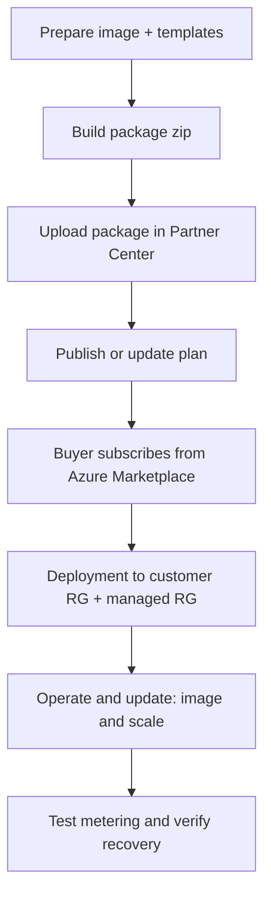

# Titan SFTP Azure Managed Application Guide

This folder documents the full lifecycle for the Titan SFTP Azure Marketplace managed application offer:

- Publish a new offer or update an existing one.
- Build and upload the deployment package.
- Subscribe and operate as a buyer.
- Run AKS and metering troubleshooting commands.

## What Is Included

- `How to Create Azure Managed Plan Container Offer in Azure Market Place.docx` - original source document.
- `publisher-offer-lifecycle.md` - publisher flow from packaging to publish/update.
- `buyer-subscription-and-update.md` - buyer subscription, update, and access model.
- `aks-operations-cookbook.md` - day-2 AKS and pod operations commands.
- `metering-failure-test-playbook.md` - metering failure simulation and recovery steps.

## End-to-End Flow

## Quick Start

1. Read `publisher-offer-lifecycle.md` and run the packaging command.
2. Upload the generated ZIP in Partner Center Technical Configuration.
3. Publish the update.
4. Validate using steps in `buyer-subscription-and-update.md`.
5. Use `aks-operations-cookbook.md` for runtime checks and support operations.
