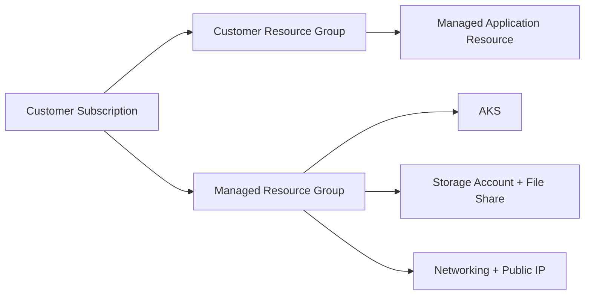

# Buyer Subscription and Update Guide

This guide explains deployment behavior, buyer update options, and safe update workflows.

## Managed Resource Group Model

Marketplace managed applications deploy into two scopes:

- Customer-chosen resource group (contains the managed application resource).
- Azure-created managed resource group (contains AKS, storage, networking, and runtime infrastructure).



## Subscription as Buyer (High-Level)

1. Open the offer in Azure Marketplace.
2. Choose plan and click **Create**.
3. Provide required parameters in the UI.
4. Validate and deploy.
5. Monitor deployment in Azure Portal.

## Key Deployment Inputs

- **Storage Account Name (optional)**:
  - Empty: deployment auto-generates a valid unique name.
  - Provided: deployment attempts to create that exact name.
- **File Share Name**:
  - Azure File Share name created in the selected storage account.
  - Default can be `titansftp`.

## Update Existing Subscription with Script

Script: `update-managed-app.ps1`

Supported operations:

- Image update via `-ImageTag`
- Scale update via `-NodeCount`
- Combined image + scale update

### Scale only

```powershell
powershell -ExecutionPolicy Bypass -File "C:\SRT\Work\2026\July\15-July\Code\update-managed-app.ps1" -ResourceGroup "rohit_kapoor_rg" -NodeCount 3
```

### Image only

```powershell
powershell -ExecutionPolicy Bypass -File "C:\SRT\Work\2026\July\15-July\Code\update-managed-app.ps1" -ResourceGroup "rohit_kapoor_rg" -ImageTag "1.0.16"
```

### Image + scale

```powershell
powershell -ExecutionPolicy Bypass -File "C:\SRT\Work\2026\July\15-July\Code\update-managed-app.ps1" -ResourceGroup "rohit_kapoor_rg" -ImageTag "1.0.16" -NodeCount 3
```

## Update Existing Subscription from Azure Portal

Use **Custom deployment** to redeploy template parameters on the same resource group.

1. Open existing managed application deployment.
2. Select **Custom deployment**.
3. Edit parameters (for example node count, image version).
4. Confirm same subscription and existing resource group.
5. Run **Review + Create** and then **Create**.

Deployment mode is incremental:

- Existing resources stay intact.
- Only changed parameter-dependent resources update.

## Seller and Buyer Validation Checklist

- Offer version published in Partner Center.
- Buyer can subscribe successfully.
- AKS comes up healthy.
- Storage and file share mount is validated.
- Image update path tested.
- Scale path tested.
