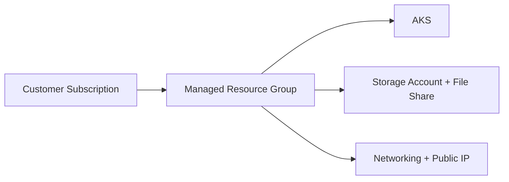

# Buyer Subscription and Update Guide

This guide explains how a buyer subscribes, deploys, and updates Titan SFTP from Azure Marketplace.

## Buyer Marketplace Launch Link

Use this buyer entry link:

[Open Titan SFTP in Azure Marketplace](https://portal.azure.com/#view/Microsoft_Azure_Marketplace/GalleryItemDetailsBladeNopdl/id/southrivertech1586314123192.tn-sftp-ent-managed-app-cont-preview)

After Azure sign-in, subscription and plan can be auto-selected based on account context.

## Managed Resource Group Model

Marketplace managed applications

## Subscribe as Buyer (Portal UI Flow)

1. Open the Azure Marketplace link above.
2. Confirm the selected **Subscription** and **Plan**.
3. Click **Create**.
4. Fill in the deployment form on the **Basics** tab.
5. Select **Review + create** and then **Create**.
6. Monitor deployment status in Azure Portal notifications and deployment history.

## Deployment Form Details (Buyer)

### Project details

- **Subscription**: choose the billing subscription.
- **Resource group**: select existing or create a new one.

### Instance details

- **Location**
- **AKS Cluster Name** (example: `titansftp-aks`)
- **Node Count**
- **Node VM Size**
- **Kubernetes Version**
- **Titan Admin Username**
- **Titan Admin Password** and **Confirm Password**

### Other details Including SQL and file share options

- **Create managed Azure SQL and configure Titan clustering** (checkbox)
- **Azure SQL Server Name (optional)**
- **Azure SQL Database Name**
- **Azure SQL Admin Username / Password**
- **Create managed Azure File Share and mount as Titan User Data Directory** (checkbox)
- **Storage Account Name (optional)**
- **File Share Name**

### Managed application details

- **Application Name**
- **Managed Resource Group**

## Key Deployment Inputs

- **Storage Account Name (optional)**:
  - Empty: deployment auto-generates a valid unique name.
  - Provided: deployment attempts to create that exact name.
- **File Share Name**:
  - Azure File Share name created in the selected storage account.
  - Default can be `titansftp`.

## Update Existing Subscription from Azure Portal

Use **Custom deployment** to redeploy template parameters on the same resource group.

1. Open existing managed application deployment.
2. Select **Custom deployment**.
3. Edit parameters (for example node count, image version).
4. Confirm same subscription and existing resource group.
5. Run **Review + Create** and then **Create**.

Deployment mode is incremental:

- Existing resources stay intact.
- Only changed parameter-dependent resources update.

## Buyer Validation Checklist

- Buyer can subscribe successfully.
- AKS comes up healthy.
- Storage and file share mount is validated.
- Update path through portal custom deployment is tested.
